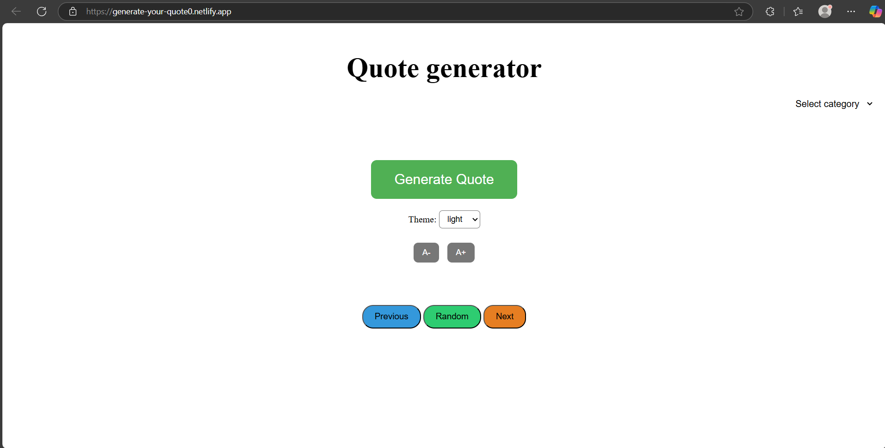
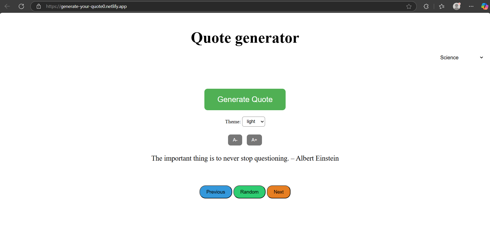
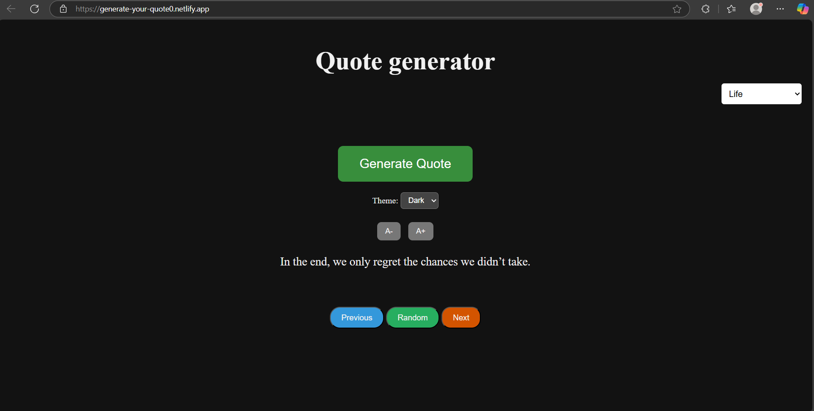

# Quote Generator

A simple and interactive **Quote generator** web app that allows users to explore inspiring quotes by category. Features include random quote display, quote navigation, font size control, and light/dark theme switching.


### Click [Here](https://generate-your-quote0.netlify.app/) to visit this site.

---
## Features 
-  Generate random quotes from categories: Science, Philosophy, Motivation, and Life.
-  Navigate through quotes using **Previous** and **Next** buttons.
-  Adjust the font size of the displayed quote.
-  Toggle between **Light** and **Dark** themes.


## Technologies Used  

- HTML
- CSS
- JavaScript


## **Steps to Run**:  


#### 1. Clone the repository and run  
```bash  
git clone https://github.com/yogendrabaskota/GenerateYour-Quote.git
```
```https 
  cd quote-generator
``` 


## Output :
- Home page:

- Generating Quote:

- Dark theme:



## Feedback
  If you have any feedback, please reach out to me at yogendrabaskota18@gmail.com  


